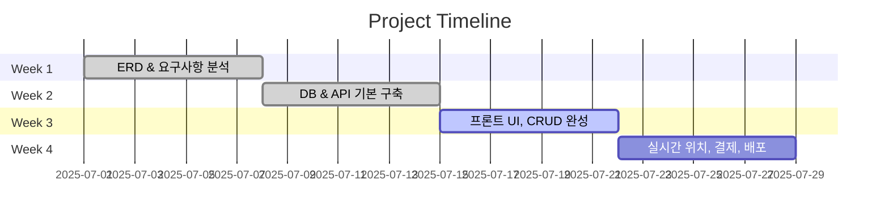

# 🐿️ Squirrel Logistics (다람쥑스프레스)

> 물류 운송 매칭 플랫폼 | 5인 팀 프로젝트 | K-Digital Training

---

## ✨ 프로젝트 소개
- 🚚 **화물 의뢰자, 운송사, 기사**를 연결하는 풀스택 물류 매칭 서비스  
- 💡 **실시간 위치 추적, 경로 탐색, 비용 정산**까지 올인원 지원  
- 👥 **5인 팀 프로젝트** (프론트 2, 백엔드 3)

---

## 📸 주요 화면 (Screenshots & GIF Demos)

| 메인 페이지 | 기사 전용 앱 | 배송 실시간 추적 |
|:---:|:---:|:---:|
|  |  |  |

---

## 🛠️ 기술 스택

  
  
  
  
  
  
  

---

## 📐 아키텍처

---

## 📊 ERD (데이터 모델링)

---

## 🚀 주요 기능
- [x] 회원가입/로그인 (OAuth2, JWT)  
- [x] 운송 의뢰 생성 & 수락  
- [x] 실시간 기사 위치 WebSocket 추적  
- [x] Kakao API 경로 탐색, 비용 산출  
- [x] PortOne 결제 연동 (선결제/후결제 분리)  
- [x] 기사 수익/정산 관리 대시보드  

---

## 📅 개발 타임라인

## 👥 팀 소개 & 역할
이름	역할	주요 기여
- 🦝 A	PM / 백엔드	요구사항 정의, DB설계, 배포
- 🐥 B	백엔드	API 개발, JWT 인증
- 🐘 C	백엔드	기사 위치추적, Kakao API
- 🐿️ D	프론트	React UI, Kakao Map
- 🐱 E	프론트	디자인, 관리자 대시보드

## 📽️ 시연 영상

## 📝 프로젝트 관리 흔적

## 🗂️ Notion 협업 보드

## 🐙 GitHub Issues & PR 기록

## ✅ Jira/Trello 태스크 관리 스크린샷 첨부

## 🙌 마무리

본 프로젝트는 K-Digital Training 최종 팀 프로젝트로 진행되었습니다.
실제 서비스 수준의 설계와 구현을 목표로 하였으며,
팀워크와 협업 문화를 중점적으로 실천했습니다.
