

  

  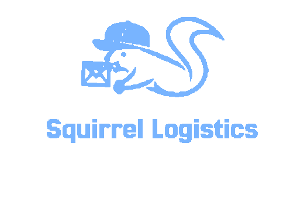

 

[![Notion Hub][badge-notion]][link-notion]
[![Web][badge-vercel]][link-web] [![API][badge-render]][link-api]
[![Demo Video][badge-youtube]][link-youtube]

---

## 🐿️ 프로젝트 소개

 

> **다람쥑스프레스**는 화주(회사)와 기사(드라이버)가 **하나의 플랫폼**에서 
> 배차 · 추적 · 정산을 **실시간**으로 처리하는 양방향 물류 서비스입니다.

 

**핵심 차별점**
- 진행 중 운송의 실시간 위치/상태 추적
- 예상가 ↔ 실제 운행 데이터를 분리한 2단계 정산(명세서/영수증 제공)
- 최대 3개 경유지 기반 경로 최적화(거리·무게·차종 반영)
- 다크 모드 지원(장시간 사용 피로 최소화)

---
## 🐿️아키텍처 및 기술 스택

<table>
  <thead>
    <tr>
      <th>Frontend</th>
      <th>Backend</th>
      <th>Database / Infra</th>
      <th>External APIs</th>
      <th>Collaboration & Ops</th>
    </tr>
  </thead>
  <tbody>
    <tr>
      <td align="center">
          

      </td>
      <td align="center">

      </td>
      <td align="center">

      </td>
      <td align="center">

      </td>
      <td align="center">

      </td>
    </tr>
  </tbody>
</table>

---

## 🐿️ 데이터 모델(ERD)

 

  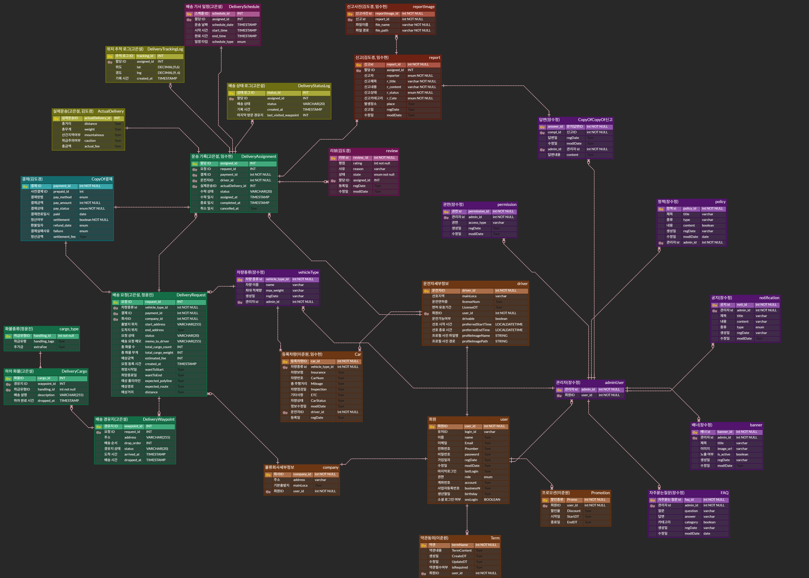

 

- **User / Company / Driver**: 사용자·회사·기사 기초 정보 및 권한
- **DeliveryRequest(운송요청)**: 출발/도착·경유지·화물/차종·요금 파라미터
- **DeliveryAssignment(배차)**: 요청당 활성 1건, 기사 선택/배정 상태
- **ActualDelivery(실제운송)**: 실시간 이동/상태 로그·경유지 통과 기록
- **TrackingLog / StatusLog**: 위치 좌표·상태 전이 기록
- **Payment(1차/2차) & Receipt**: 예상/실제 경로 반영, 영수증 증빙
- **Review / Report / Evidence**: 리뷰·신고/증빙(사진 등)
- **Vehicle / VehicleType**: 기사 차량 및 차종 메타
- **Policy / Banner / Notice**: 관리자 정책·배너·공지 운영

---

## 🐿️ 주요 기능
> 각 기능은 접기(Details) 블록으로 구성되어 클릭으로 펼쳐볼 수 있습니다.

  
<b>1) 회원가입/로그인 (로컬 & 소셜)</b>

 

- 로컬(ID/PW) + Google/Kakao OAuth
- 비밀번호 재설정/본인인증 플로우

  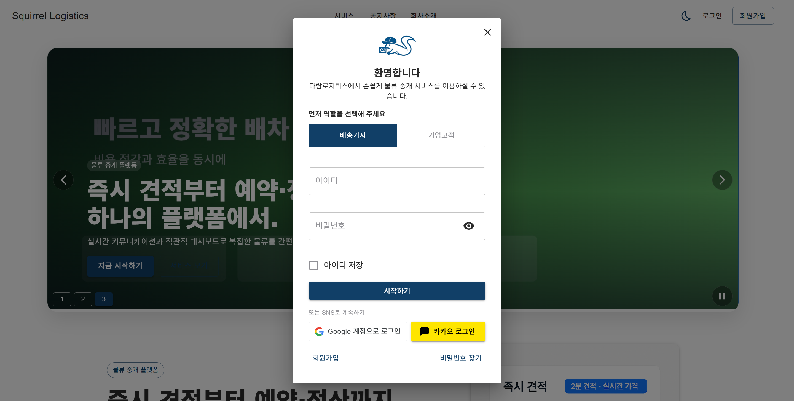 
  로그인 화면 (구글 및 카카오 소셜 로그인 가능)

  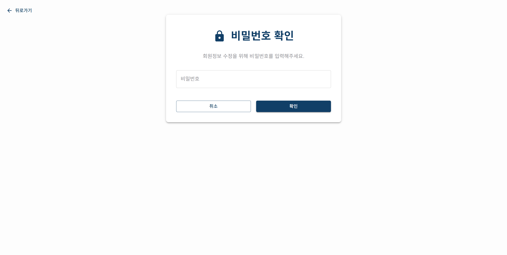 
  기업, 운전 기사 모두 개인 정보 수정 시 암호 재인증 요청

  
<b>2) 예상 견적 산출/ 기사 지명</b>

    
 

- 출발/도착 + 최대 3개 경유지
- 화물/차량, 거리·무게 슬라이더 → 예상가 자동 산출
- 평점/필터·프로필 열람 → 지명 요청

  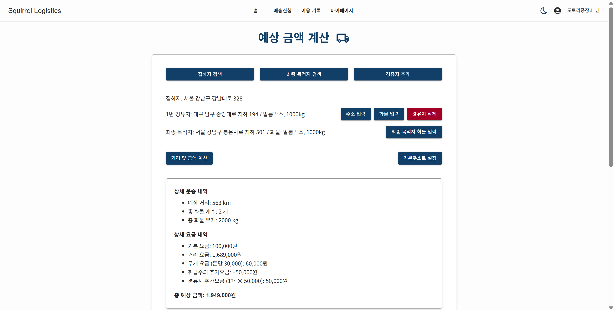 
  운송 의뢰 기업이 주소, 화물 입력 시 예산 견적 출력

  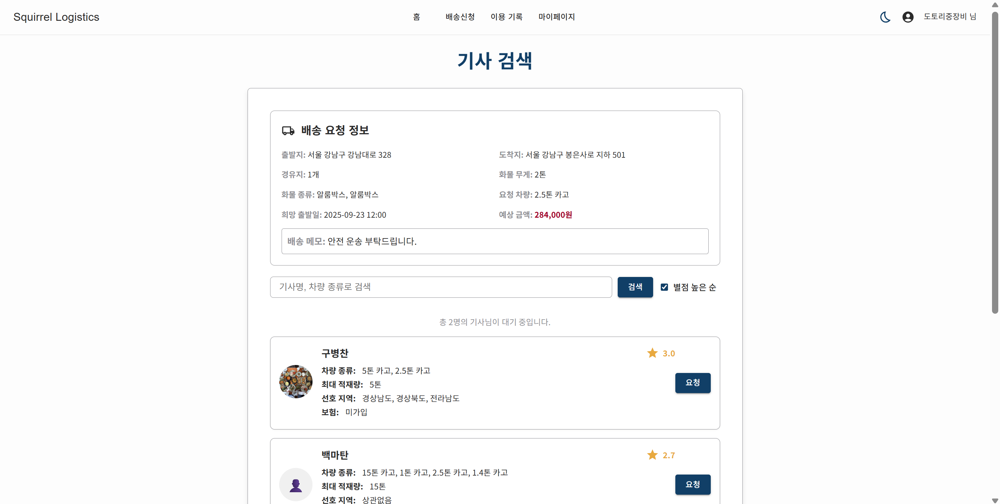 
  특정 운전 기사 지명 희망시 기사 검색 화면으로 이동

  
<b>3) 결제(1차) & 영수증</b>

 

- PortOne 결제 연동, 약관/수단 선택
- 거래 명세서 및 영수증 출력

  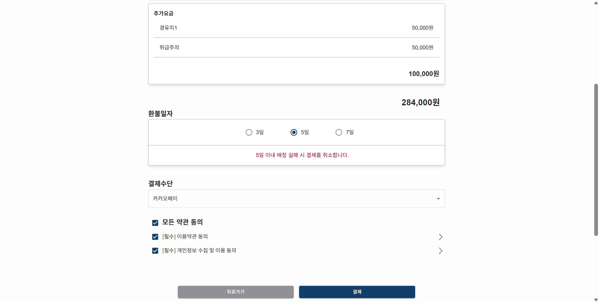 
  결제 수단 선택, 약관 동의 시 결제로 넘어감

  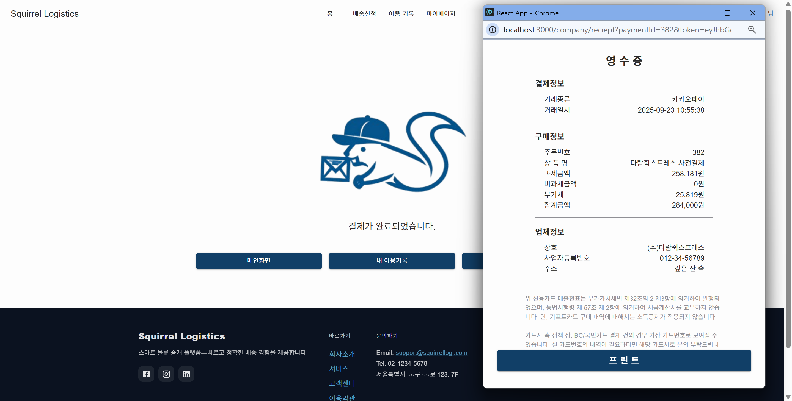 
  결제 성공 화면, 영수증 출력 가능

  
<b>4) 운송 실시간 추적</b>

 

- WebSocket/STOMP 기반 위치/상태 실시간 반영
- 지도 경로 시각화, 버튼 입력을 통한 운송 상태 변화 (픽업/도착/하차)
- 이동 경로 기록 및 이탈 여부 확인을 위한 더미 운전자 모델

  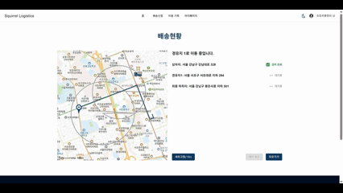 
  운송 의뢰 기업측 진행중인 나의 운송 현황 실시간 확인 가능

   
  운송 담당 운전 기사는 수동 버튼 입력으로 운송 상태 변경

  
<b>5) 실계산(2차 정산)</b>

 

- 실제 주행 거리/ 경로 출력
- 길제 이동 경로 기반 최종 금액 산출

  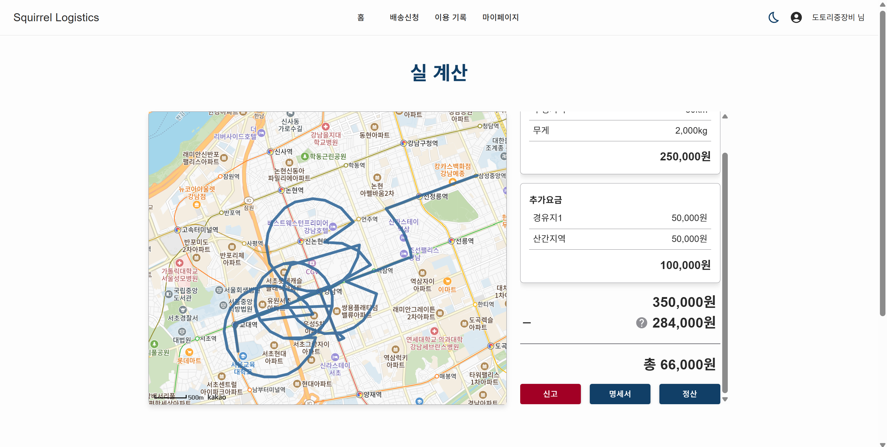 
  운송 완료시 실제 이동 경로에 따른 추가 요금 및 환불 2차 결제

  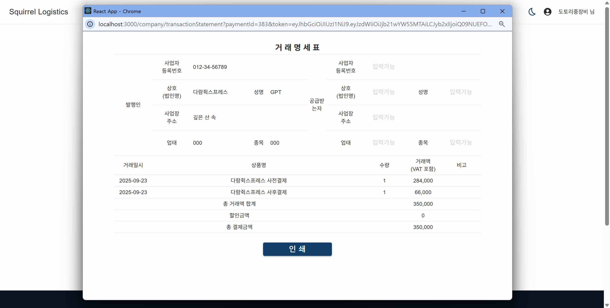 
  완료된 결제건에 대한 거래 명세서 출력 가능

  
<b>6) 이용기록/리뷰</b>

 

- 완료된 운송에 대한 리뷰 및 신고 작성/수정
- 전체 완료 운송 내역 확인

  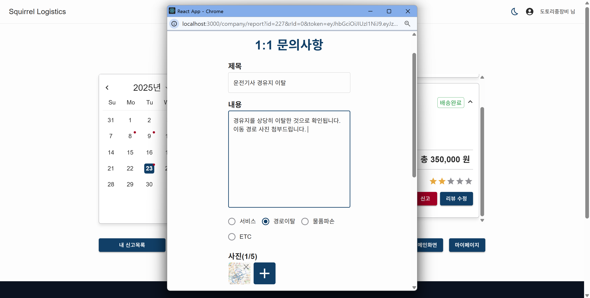 
  운송 의뢰 기업은 완료된 운송건에 대하여 리뷰 및 신고 작성이 가능

  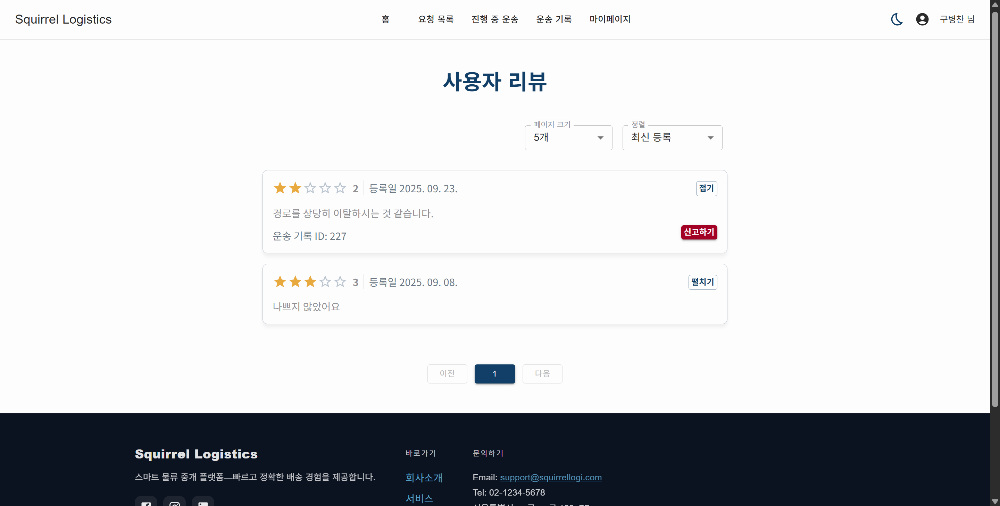 
  작성된 운송 리뷰는 운전 기사 측에서 확인 가능

  
<b>7) 관리자 기능(회원/신고/정산 관리)</b>

 

- 회원/ 차종 관리
- 신고 대시보드 및 신고 관리
- 정산 대시보드 및 미정산 결제건 관리

  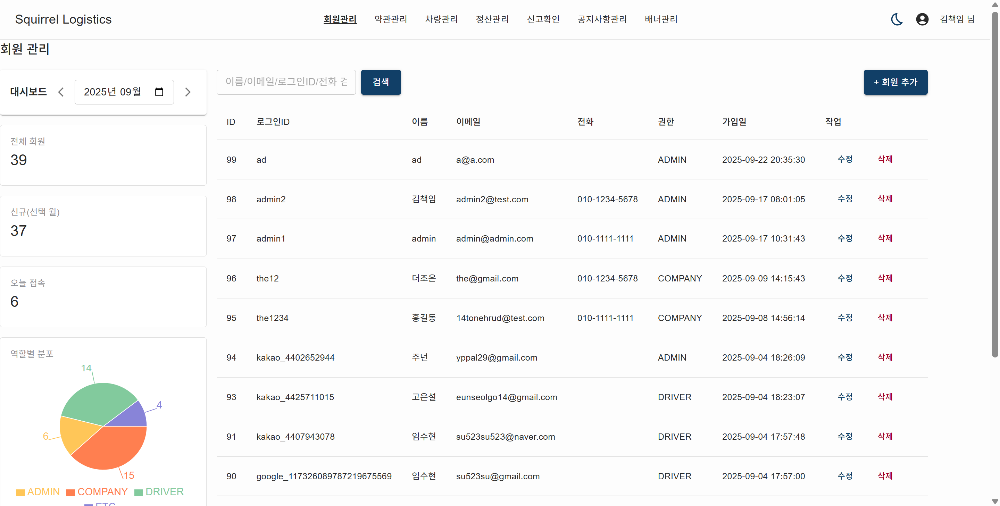 
  회원 대시보드를 통한 가입 회원 정보 확인 및 탈퇴 처리 관리

  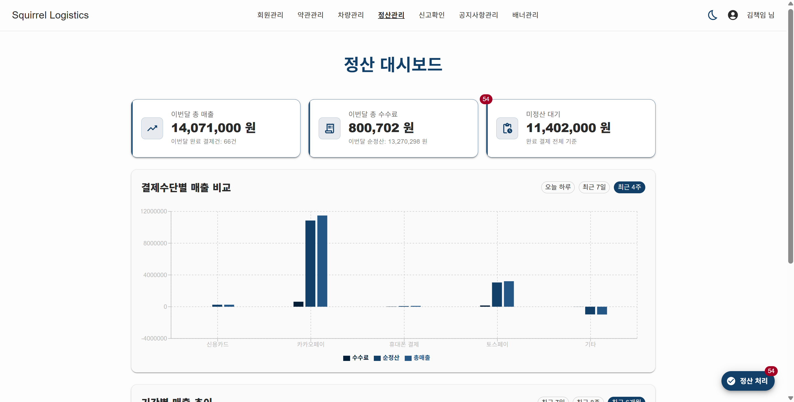 
  정산 대시보드를 통한 추이 확인 및 미정산 결제건에 대한 정산 관리

   
  신고 대시보드를 통한 현황 확인 및 신고 대응 및 답글을 통한 유저 서비스 지원

---

## 🐿️ 역할 및 담당 기능

  <table>
    <colgroup>
    <col width="140" /> 
    <col width="360" />
    <col width="500" />
    </colgroup>
    <tr>
      <th>이름</th>
      <th>담당 영역</th>
      <th>핵심 기여</th>
      <th>Git Hub</th>
    </tr>
    <tr>
      <td nowrap><nobr>고은설</nobr></td>
      <td>실시간 위치 추적, 요청 목록, 캘린더(이용기록/기사 일정), 관리자단 공지/정산 관리</td>
      <td>WebSocket 실시간 트래킹, 요청 리스트/필터, 일정 캘린더, 관리자 공지·정산 대시보드</td>
      <td nowrap><a href="https://github.com/eunseolgo14/eunseolgo14">[바로가기]</a></td>
    </tr>
    <tr>
      <td nowrap><nobr>김도경</nobr></td>
      <td>결제/실계산, 이용기록, 리뷰, 신고/문의, 관리자단 신고/배너 관리</td>
      <td>PortOne 결제·영수증, 1차/2차 정산 로직, 기록/리뷰/신고 도메인 + 관리자 배너 운영</td>
      <td nowrap><a href="https://github.com/kkkddkkk/kkkddkkk">[바로가기]</a></td>
    </tr>
    <tr>
      <td nowrap><nobr>이준원</nobr></td>
      <td>메인, 로그인, 공통 Header/Footer, 관리자단 회원/차량/정책 관리</td>
      <td>통합 네비게이션/레이아웃 설계, 인증 플로우 구현, 관리자 정책 관리 UI/CRUD</td>
      <td nowrap><a href="">[바로가기]</a></td>
    </tr>
    <tr>
      <td nowrap><nobr>임수현</nobr></td>
      <td>차량 정보, 운송 내역, 기사 정보, 신고/문의</td>
      <td>차량 등록/상태 관리, 운송 기록·상세, 기사 프로필, 문의/신고 UX</td>
      <td nowrap><a href="">[바로가기]</a></td>
    </tr>
    <tr>
      <td nowrap><nobr>정윤진</nobr></td>
      <td>예상 금액 산정, 기사 요청/배송 조회, 회사 정보</td>
      <td>거리·무게 기반 요금 산정, 기사 검색/지명, 회사 정보 화면 및 상태관리</td>
      <td nowrap><a href="">[바로가기]</a></td>
    </tr>
  </table>

---

## 🐿️ 문서 & 링크 모음

- 📁 회의록 모음: [바로가기][link-meetings]
- 🎨 와이어프레임 모음: [바로가기][link-wireframes]
- 🔧 버그 리포트: [바로가기][link-QA]
- 🎞️ 프로젝트 후기: [바로가기][link-review]
- 📷 Sourcetree & Jira 스크린샷: [바로가기][link-process]
- 📑 프로젝트 설명 슬라이드(PDF): [열기][link-slides]

[badge-notion]: https://img.shields.io/badge/Notion-Hub-222222?logo=notion&logoColor=white
[badge-vercel]: https://img.shields.io/badge/Web-Vercel-000000?logo=vercel&logoColor=white
[badge-render]: https://img.shields.io/badge/API-Render-8A05FF?logo=render&logoColor=white
[badge-youtube]: https://img.shields.io/badge/Demo-YouTube-FF0000?logo=youtube&logoColor=white

[link-web]: https://squirrellogistics.vercel.app/
[link-api]: https://squirrellogistics.onrender.com/
[link-notion]: https://psychedelic-deposit-53c.notion.site/238ee5b3591b8110b194f99df7927bb8
[link-youtube]: https://www.youtube.com/watch?v=G7L4YzGAvMA

[link-meetings]: https://psychedelic-deposit-53c.notion.site/23aee5b3591b802aa139ca4f8e204fdd  
[link-wireframes]: https://psychedelic-deposit-53c.notion.site/238ee5b3591b812c8af1f8b341f84923
[link-QA]: https://docs.google.com/document/d/1CdPrMlS6cWPc1OGrYjUdcxz2uonGgzWAz-G8-kWZNmI/edit?tab=t.0
[link-review]: https://psychedelic-deposit-53c.notion.site/238ee5b3591b80559ccaf7bc4d7484ac
[link-process]: https://psychedelic-deposit-53c.notion.site/276ee5b3591b8042b733fe10e7507689       
[link-slides]: ./assets/slides.pdf                         
